# Credentials Variable Set
[https://developer.hashicorp.com/terraform/tutorials/cloud-get-started/cloud-create-variable-set](https://developer.hashicorp.com/terraform/tutorials/cloud-get-started/cloud-create-variable-set)

One common use case for variable sets is for provider credentials
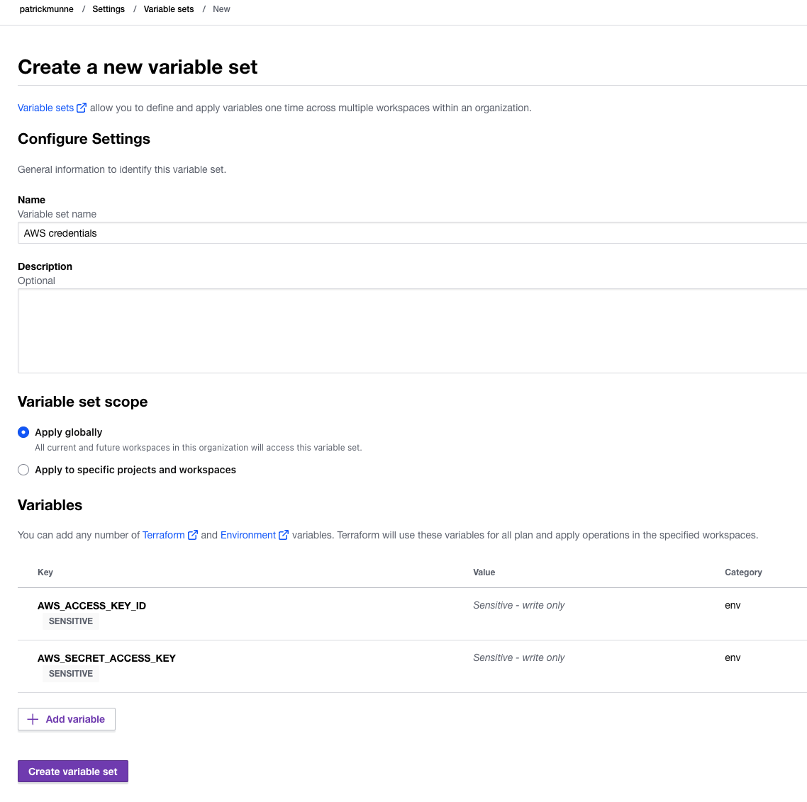  

# Create a Workspace

[https://developer.hashicorp.com/terraform/tutorials/cloud-get-started/cloud-workspace-create](https://developer.hashicorp.com/terraform/tutorials/cloud-get-started/cloud-workspace-create)

 In this tutorial, you will create a CLI-driven workspace.

 using the following git repo 
 
 ```
 git clone https://github.com/hashicorp/learn-terraform-cloud.git
 ```
  
At the end you should have a workspace to use in TFC  
 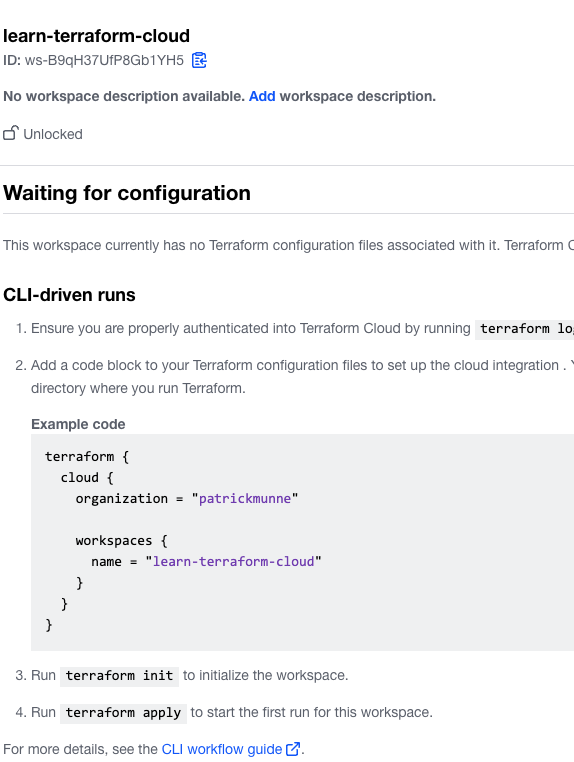  

 # Create Infrastructure

[https://developer.hashicorp.com/terraform/tutorials/cloud-get-started/cloud-workspace-configure]

Add 2 variables  
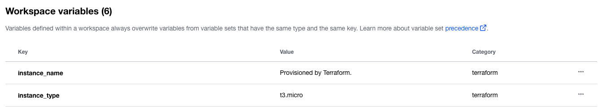  

Do a run

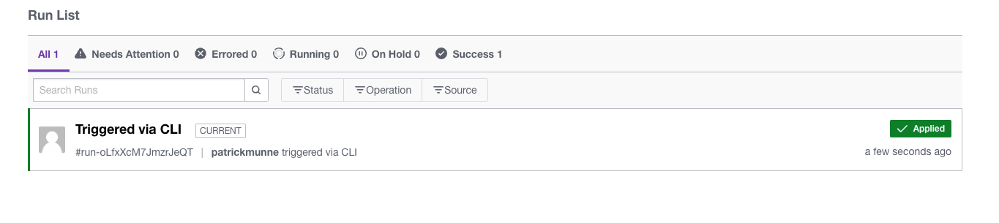  

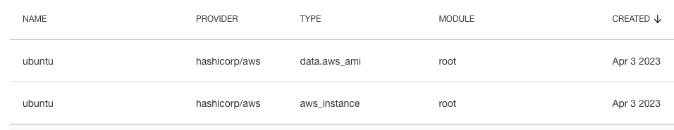  

# Change Infrastructure
https://developer.hashicorp.com/terraform/tutorials/cloud-get-started/cloud-change

Update the infrastructure to a different instance_type

```
terraform apply -var="instance_type=t2.small"
```

```
  # aws_instance.ubuntu will be updated in-place
  ~ resource "aws_instance" "ubuntu" {
        id                           = "i-05025900fdfa85734"
      ~ instance_type                = "t3.micro" -> "t2.small"
        tags                         = {
            "Name" = "Provisioned by Terraform."
```


# Use VCS-Driven Workflow
[https://developer.hashicorp.com/terraform/tutorials/cloud-get-started/cloud-vcs-change](https://developer.hashicorp.com/terraform/tutorials/cloud-get-started/cloud-vcs-change)

Change the workspace to VCS workflow with the same code

You see it wants to change it back to t3.micro  

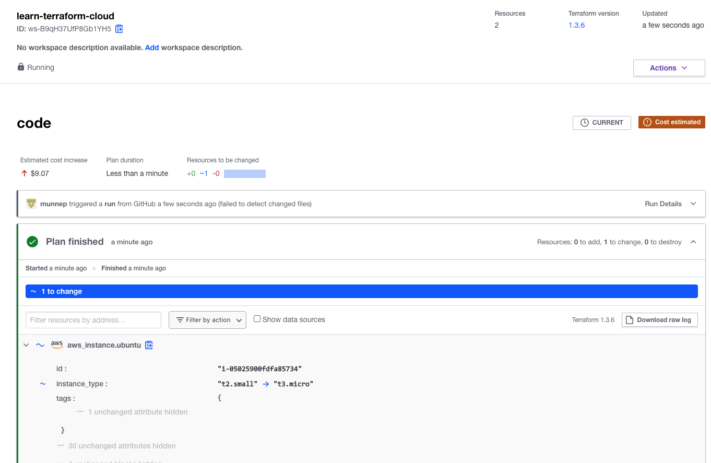  

# Destroy Resources and Workspaces
[https://developer.hashicorp.com/terraform/tutorials/cloud-get-started/cloud-destroy](https://developer.hashicorp.com/terraform/tutorials/cloud-get-started/cloud-destroy)

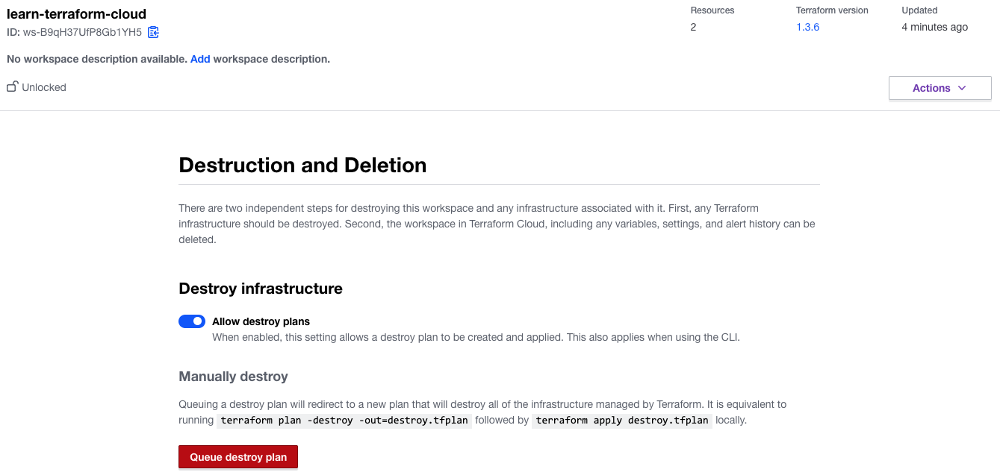  
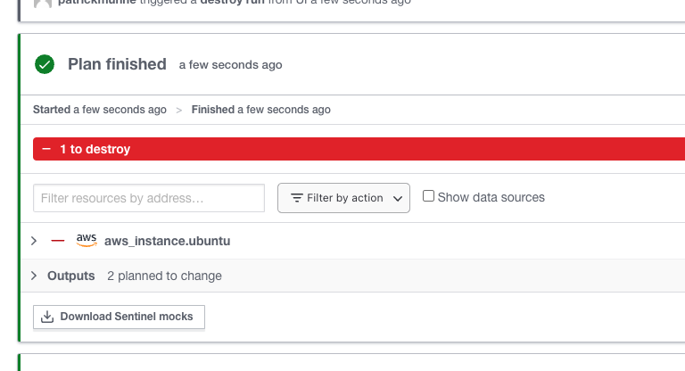  
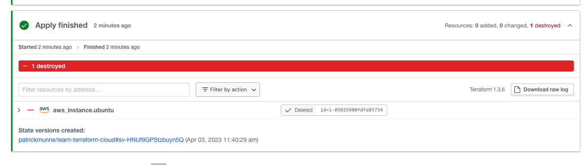  


# Enforce a policy
[https://developer.hashicorp.com/terraform/tutorials/cloud-get-started/policy-quickstart](https://developer.hashicorp.com/terraform/tutorials/cloud-get-started/policy-quickstart)
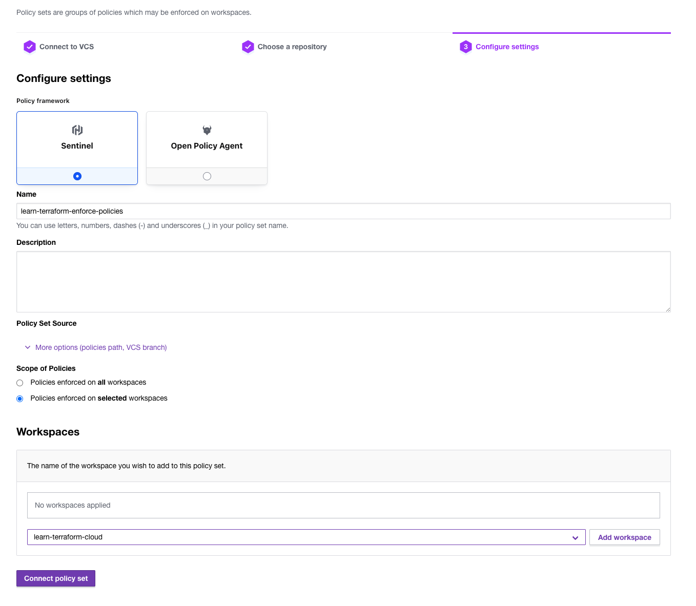     
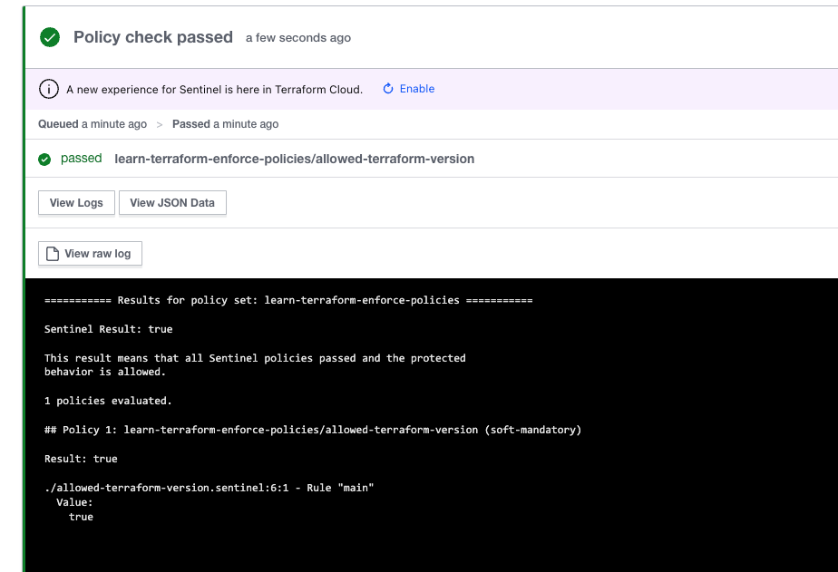   

# Control Costs with Policies
[https://developer.hashicorp.com/terraform/tutorials/cloud-get-started/cost-estimation](https://developer.hashicorp.com/terraform/tutorials/cloud-get-started/cost-estimation)

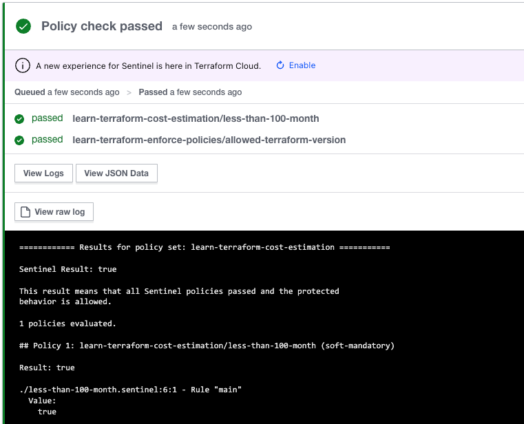  

With a higher instance type that will cost to much  
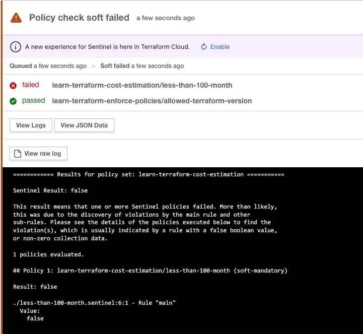  
